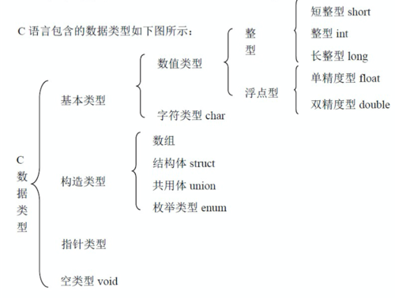

# 数据类型总结

### C语言数据类型

### sizeof 一般形式为：sizeof（object），也可以sizeof var(var_char指的是变量名,或者表达式，也可以是函数的调用:func()),不过大部分程序员习惯用sizeof()。
### 对象可以是表达式或者数据类型名，当对象是表达式时，括号可省略。sizeof是单目运算符，其运算符的含义是：求出对象在计算机内存中所占用的字节数。
### 判断数据类型长度符的关键字
### 用法
#### sizeof (类型说明符) 或者 sizeof 表达式
### 定义
#### sizeof是C/C++中的一个操作符（operator），简单的说其作用就是返回一个对象或者类型所占的内存字节数。
